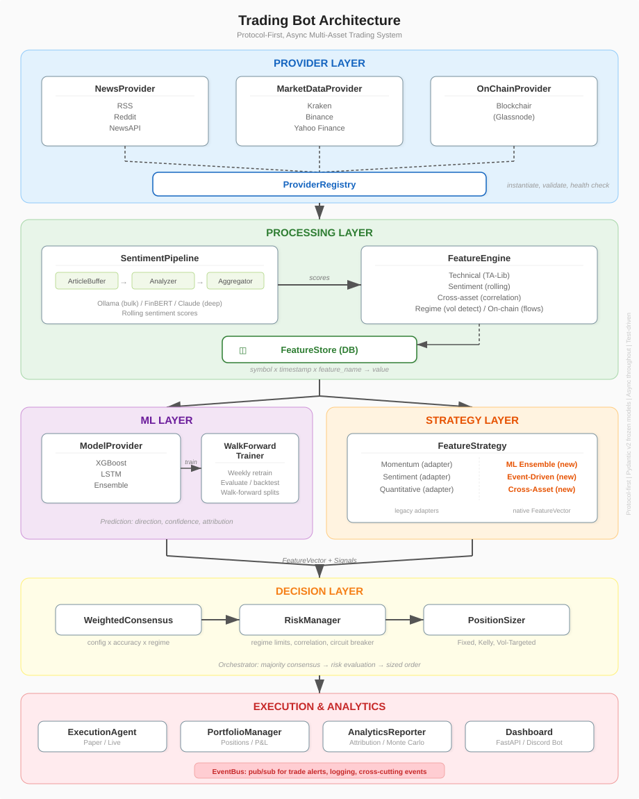

# Trade Bot

Protocol-first agentic trading system for crypto and equities.

## Overview

Trade Bot is a multi-asset automated trading system built on a protocol-first architecture. Every major subsystem -- providers, strategies, risk management, ML models -- is defined as a Python `typing.Protocol`, decoupling interface from implementation and making the entire system testable via mock providers. The system supports both paper and live trading through a consensus-based decision engine that coordinates six trading strategies, an ML pipeline, sentiment analysis, and regime-aware risk management.

The core design philosophy is one of radical composability. Rather than building a monolithic trading engine where components are tightly coupled through inheritance hierarchies or shared mutable state, every boundary in the system is a protocol contract. Providers can be swapped without changing a single line of downstream code. Strategies operate on immutable feature snapshots rather than reaching into global state. Risk evaluation is a pure pipeline that transforms a signal and portfolio snapshot into an approve/veto/resize decision. This architecture means the system can be tested exhaustively with mock providers -- no API keys, no network calls, no exchange accounts -- while maintaining confidence that the production wiring will behave identically, because the contracts enforced at registration time are the same contracts exercised in testing.

## Architecture



<details>
<summary>ASCII architecture diagram (text fallback)</summary>

```
+-------------------------------------------------------------+
|                     PROVIDER LAYER                          |
|                                                             |
|  NewsProvider    MarketDataProvider    OnChainProvider       |
|  +---------+    +---------------+     +--------------+     |
|  | RSS     |    | Kraken        |     | Blockchair   |     |
|  | Reddit  |    | Binance       |     | (Glassnode)  |     |
|  | NewsAPI |    | Yahoo Finance |     +--------------+     |
|  +----+----+    +------+--------+              |            |
|       |                |                       |            |
|       v                v                       v            |
|  +-----------------------------------------------------+    |
|  |              ProviderRegistry                       |    |
|  |   Instantiates from settings.yaml, health checks    |    |
|  +------------------------+----------------------------+    |
+---------------------------+-------------------------------+
                            |
                            v
+-------------------------------------------------------------+
|                   PROCESSING LAYER                          |
|                                                             |
|  SentimentPipeline             FeatureEngine                |
|  +------------------+          +------------------------+   |
|  | ArticleBuffer    |          | Technical (TA-Lib)     |   |
|  | SentimentAnalyzer|--score-->| Sentiment (rolling)    |   |
|  |   Ollama (bulk)  |          | Cross-asset (corr)     |   |
|  |   FinBERT        |          | Regime (vol detect)    |   |
|  |   Claude (deep)  |          | On-chain (flows)       |   |
|  | Aggregator       |          +-----------+------------+   |
|  +------------------+                      |                |
|                                            v                |
|                                  FeatureStore (DB)          |
|                                  +------------------+       |
|                                  | symbol x time x  |       |
|                                  | feature -> value  |       |
|                                  +--------+---------+       |
+-------------------------------------------+-----------------+
                                            |
                             +--------------+--------------+
                             v                             v
+------------------------------+  +---------------------------+
|        ML LAYER              |  |     STRATEGY LAYER        |
|                              |  |                           |
|  ModelProvider               |  |  FeatureStrategy          |
|  +----------------+          |  |  +---------------------+  |
|  | XGBoost        |--train-->|  |  | Momentum (adapter)  |  |
|  | LSTM           |  walk-   |  |  | Quant (adapter)     |  |
|  | Ensemble       |  forward |  |  | Sentiment (adapter) |  |
|  +-------+--------+          |  |  | ML Ensemble (new)   |  |
|          |                   |  |  | Event-Driven (new)  |  |
|   Trainer / Evaluator        |  |  | Cross-Asset (new)   |  |
|   (weekly retrain)           |  |  +----------+----------+  |
+--------------+---------------+  +-------------+-------------+
               |                                |
               +----------+---------------------+
                          |  FeatureVector + Predictions
                          v
+-------------------------------------------------------------+
|                   DECISION LAYER                            |
|                                                             |
|  WeightedConsensus -> RiskManager -> PositionSizer          |
|  (config x accuracy x regime weights)                       |
|  DrawdownCircuitBreaker, regime limits, correlation checks  |
+------------------------+------------------------------------+
                         v
+-------------------------------------------------------------+
|                 EXECUTION & ANALYTICS                       |
|                                                             |
|  ExecutionAgent  PortfolioManager  Attribution  Monte Carlo |
|  (Paper/Live)    (Positions/P&L)   Reporter     Simulator   |
|                                    FastAPI      Discord Bot |
+-------------------------------------------------------------+
```

</details>

---

## Provider Architecture

### Protocol-First Design

The provider layer is the entry point for all external data and services. Rather than using abstract base classes or inheritance hierarchies, Trade Bot defines every subsystem boundary as a Python `typing.Protocol` decorated with `@runtime_checkable`. This is a deliberate design choice rooted in the concept of **structural subtyping** (also known as duck typing with static type checking).

In classical OOP, a class must explicitly declare its parent via inheritance (`class Kraken(MarketDataProvider)`). This creates tight coupling: every implementation must know about and import the base class, changes to the base class cascade to all children, and testing requires either subclassing or complex mocking frameworks. With protocols, the coupling is entirely structural. A class satisfies `MarketDataProvider` if and only if it has the right methods with the right signatures. It never needs to import or reference the protocol. This means:

- **Zero inheritance coupling.** A Kraken provider and a mock provider share no common ancestor. They simply happen to have the same shape.
- **Registration-time validation.** The `ProviderRegistry` uses `isinstance()` checks (enabled by `@runtime_checkable`) to verify protocol conformance at the moment a provider is registered, not at call time. This fails fast: a misconfigured provider is caught during startup, not during a live trading session.
- **Dependency injection without a framework.** The `ProviderRegistry` acts as a dependency injection container. Components request providers by protocol type, and the registry returns whatever concrete implementation was registered. The calling code never knows or cares which implementation it received.
- **Trivial mocking.** Because protocols are structural, any object with the right method signatures is a valid mock. The `ProviderRegistry.for_testing()` factory creates a fully-wired system with mock providers in a single call. Tests can override individual mocks while keeping the rest, enabling precise fault injection without affecting other subsystems.

### Adding a New Provider

1. Read the protocol definition in `src/providers/protocols.py` (e.g., `MarketDataProvider`).
2. Create a new class that implements all required methods and properties.
3. Register it with the `ProviderRegistry`. The registry will validate protocol conformance via `isinstance()`.
4. No changes needed anywhere else in the system -- strategies, risk management, and execution will consume the new provider transparently.

### Protocol Reference

| Protocol | Methods | Purpose |
|---|---|---|
| `MarketDataProvider` | `name`, `get_ticks()`, `get_ohlc()`, `health_check()` | Price feeds, OHLC bars, and liveness probing |
| `NewsProvider` | `name`, `fetch_articles()`, `health_check()`, `rate_limit` | Article fetching with rate-limit metadata |
| `SentimentAnalyzer` | `name`, `score()`, `score_batch()` | Single-text and batch sentiment scoring |
| `OnChainProvider` | `name`, `get_metrics()`, `health_check()` | Blockchain metrics (flows, addresses, tx counts) |
| `FeatureProvider` | `name`, `required_inputs`, `compute()` | Derived indicator computation |
| `ModelProvider` | `name`, `predict()`, `train()`, `evaluate()` | ML model lifecycle (predict, train, evaluate) |
| `PositionSizer` | `name`, `compute_size()` | Trade sizing given signal, portfolio, and risk context |
| `FeatureStrategy` | `name`, `evaluate()`, `required_features()` | Signal generation from feature vectors |
| `HttpClient` | `get()`, `post()`, `close()` | HTTP transport abstraction for testability |
| `DataStore` | `initialize()`, `close()`, `save_trade()`, `list_trades()`, `save_signal()`, `list_signals()` | Persistent storage for trades and signals |
| `MarketDataAgent` | `connect()`, `disconnect()`, `stream_ticks()`, `get_order_book()` | Streaming tick interface with connection lifecycle |
| `ResearchAgent` | `run_research()`, `score_headline()` | Bulk research and headline scoring |
| `StrategyAgent` | `name`, `evaluate()` | Tick-based strategy interface (legacy, migrating to FeatureStrategy) |
| `RiskManagerAgent` | `evaluate_trade()`, `check_portfolio_health()` | Trade approval and portfolio health monitoring |
| `ExecutionAgent` | `submit_order()`, `cancel_order()`, `cancel_all()` | Order submission and cancellation |
| `PortfolioAgent` | `get_snapshot()`, `record_fill()`, `get_positions()`, `get_pnl()` | Portfolio state, fill recording, and P&L tracking |

---

## Sentiment Analysis Pipeline

### Theory

Market sentiment -- the aggregate mood of market participants toward an asset -- is one of the most difficult signals to quantify. Traditional technical indicators operate on price and volume alone, which are lagging reflections of decisions already made. Sentiment analysis attempts to capture the *intent* and *emotion* driving those decisions before they fully manifest in price. In crypto markets, where information propagates rapidly through social media and news aggregators, sentiment shifts can precede price moves by minutes to hours.

Trade Bot's sentiment pipeline transforms unstructured text (news articles, Reddit posts, RSS feeds) into a single numeric sentiment score per symbol per cycle. The pipeline is designed around four stages: ingestion, deduplication, scoring, and aggregation.

### Multi-Source Ingestion

Articles are fetched from multiple `NewsProvider` implementations (RSS, Reddit, NewsAPI) for each tracked symbol. Each provider implements the `fetch_articles()` method and returns raw article data. The pipeline iterates over all providers and all symbols, casting raw dictionaries into structured `Article` objects with title, body, source, URL, publication timestamp, and related symbols.

### Deduplication via ArticleBuffer

Raw news feeds frequently contain duplicate or near-duplicate articles (syndicated wire stories, rephrased press releases). The `ArticleBuffer` handles deduplication via content fingerprinting. When articles are ingested, the buffer computes a fingerprint for each and discards duplicates. This prevents the same story from being scored multiple times and artificially inflating or deflating the sentiment signal. The buffer exposes a `drain()` method that returns unprocessed articles for a given symbol and clears them from the buffer.

### Multi-Analyzer Scoring

Each article is scored through a `SentimentAnalyzer` implementation. The system supports multiple analyzers optimized for different tradeoffs:

- **Ollama** -- Local LLM inference for bulk scoring. Provides good accuracy at high throughput with no external API costs. Best for processing large backlogs of articles.
- **FinBERT** -- A BERT model fine-tuned on financial text. Fastest inference of the three, well-suited for real-time scoring where latency matters more than nuance.
- **Claude** -- Deep analysis via Anthropic's API. Highest accuracy and reasoning quality, used for articles that warrant careful interpretation (e.g., regulatory announcements, earnings surprises).

Each analyzer produces a `SentimentResult` containing a score (ranging from -1.0 to +1.0), a magnitude (confidence in the score), a timestamp, and optional reasoning text. Scores are persisted to the `SentimentStore` for historical lookups and analytics.

### Time-Weighted Aggregation

Raw per-article scores must be collapsed into a single aggregate per symbol. The `SentimentAggregator` does this using time-weighted decay, ensuring that recent articles influence the aggregate more heavily than stale ones. The system supports two decay modes:

- **Exponential decay** (default): `weight = 2^(-age_hours / half_life_hours)`. With a default half-life of 6 hours, an article's influence halves every 6 hours. An article from 24 hours ago contributes only 6.25% of its original weight. This models the intuition that market sentiment is memoryless -- yesterday's panic is not today's reality.
- **Linear decay**: `weight = max(0, 1 - age_hours / (half_life_hours * 4))`. Articles older than `4 * half_life` have zero weight. Simpler to reason about but less smooth than exponential.

The aggregate formula is: `sum(score * weight * magnitude) / sum(weight)`. The magnitude term means that high-confidence scores contribute more to the aggregate than low-confidence ones.

Articles older than `max_age_hours` (default 48 hours) are eligible for pruning from the rolling buffer.

### Sentiment Velocity

Beyond the absolute sentiment score, the system computes **sentiment velocity** -- the rate of change in sentiment over a short window. A rapidly deteriorating sentiment score (even if still positive) can signal an impending reversal. Velocity is exposed as a feature in the FeatureVector (`sentiment_velocity`) and consumed by strategies like EventDrivenStrategy.

### Integration with Trading

Sentiment features feed into the FeatureVector as `sentiment_avg_6h` (rolling 6-hour average), `sentiment_velocity` (rate of change), `article_volume_ratio` (current article count vs. baseline), and `sentiment_dispersion` (disagreement among sources). These features are consumed by the SentimentAdapter strategy, the EventDrivenStrategy, and the ML pipeline.

---

## Feature Engineering

### Theory

Raw market data -- prices, volumes, article text -- is not directly useful for systematic trading decisions. Feature engineering transforms this raw data into a structured, normalized representation that strategies and ML models can consume. The quality of features is often the single largest determinant of trading system performance; a mediocre model on excellent features will outperform an excellent model on mediocre features.

### FeatureVector as Immutable Snapshot

The central data structure is the `FeatureVector`: a Pydantic frozen model keyed by `(symbol, timestamp)` containing a dictionary of named features. Immutability is critical here. A FeatureVector represents the state of the world at a specific point in time for a specific asset. Once created, it cannot be modified. This prevents an entire class of bugs where one component mutates a shared feature snapshot, causing downstream consumers to see inconsistent data. Strategies receive a FeatureVector and can trust that it will not change out from under them, even across concurrent async evaluations.

Each FeatureVector exposes a `to_array(feature_names)` method that converts the named features into a positional float array, which is the format expected by ML models (XGBoost feature matrices, LSTM input tensors).

### Technical Indicators

Technical indicators are computed from OHLCV (Open, High, Low, Close, Volume) data using TA-Lib:

- **Simple Moving Averages (SMA)**: `sma_5`, `sma_14`, `sma_50`. The arithmetic mean of closing prices over N periods. SMA crossovers (short-term crossing above long-term) are classical trend-following signals. The 5/14 pair captures short-term momentum; the 50-period SMA serves as a medium-term trend filter.
- **Relative Strength Index (RSI)**: Oscillator measuring the speed and magnitude of directional price movements. RSI ranges from 0 to 100; readings above 70 suggest overbought conditions, below 30 suggest oversold. Useful for mean-reversion strategies.
- **MACD (Moving Average Convergence Divergence)**: Difference between 12-period and 26-period exponential moving averages. The MACD signal line (9-period EMA of MACD) generates crossover signals. MACD captures momentum shifts that simple SMAs miss.
- **Bollinger Bands**: A volatility envelope -- the 20-period SMA plus/minus 2 standard deviations. Price touching the upper band suggests overextension; touching the lower band suggests a potential reversal. The band width itself is a volatility indicator.
- **Average True Range (ATR)**: Measures market volatility by decomposing the entire range of a bar. Used for stop-loss placement and position sizing -- wider ATR means wider stops.
- **On-Balance Volume (OBV)**: Cumulative volume flow indicator. Rising OBV with rising price confirms the trend; divergence (rising price, falling OBV) warns of weakness.
- **VWAP (Volume-Weighted Average Price)**: The average price weighted by volume. Institutional benchmark -- price above VWAP suggests bullish bias, below suggests bearish.
- **ADX (Average Directional Index)**: Measures trend strength regardless of direction. ADX above 25 indicates a trending market (favorable for momentum strategies); below 20 indicates a ranging market (favorable for mean-reversion).

### Sentiment Features

Derived from the sentiment pipeline output:

- **`sentiment_avg_6h`**: Rolling 6-hour time-weighted average sentiment score.
- **`sentiment_velocity`**: Rate of change in sentiment -- how fast sentiment is shifting.
- **`article_volume_ratio`**: Current article count relative to a rolling baseline. A spike (ratio > 3x) indicates unusual news activity and is the primary trigger for the EventDrivenStrategy.
- **`sentiment_dispersion`**: Disagreement among sentiment sources. High dispersion (bullish articles and bearish articles simultaneously) suggests uncertainty and is used as a confidence discount.

### Cross-Asset Features

- **`btc_eth_corr_30d`**: 30-day rolling correlation between BTC and ETH returns. High correlation (> 0.6) enables cross-asset leader-follower strategies.
- **`btc_momentum_lead`**: BTC's short-term momentum, used as a leading indicator for altcoins. When BTC moves first and correlated altcoins lag, the CrossAssetStrategy detects this divergence.

### Regime Features

- **Volatility percentile**: Current volatility relative to its historical distribution. Used to classify the market into LOW/MEDIUM/HIGH volatility regimes.
- **Trend detection**: Combines ADX, SMA slopes, and momentum indicators to classify the market as trending or ranging. Regime detection feeds into the WeightedConsensus to adjust strategy weights dynamically.

### On-Chain Features

- **Exchange inflow/outflow ratios**: Net flow of tokens into or out of exchanges. Large inflows to exchanges often precede selling pressure.
- **Active address trends**: Rising active addresses suggest growing network adoption; declining addresses suggest waning interest.

### FeatureStore

All computed features are persisted to the `FeatureStore`, a database table keyed by `(symbol, timestamp, feature_name) -> value`. This enables:

- Time-range queries for ML training datasets.
- Historical feature lookups for backtesting without recomputation.
- Feature drift detection by comparing recent feature distributions to historical baselines.

---

## ML Pipeline

### Theory

Technical indicators and sentiment scores provide useful signals, but they are hand-crafted heuristics. Machine learning models can discover nonlinear relationships between features that human-designed rules miss. Trade Bot's ML pipeline provides a structured framework for training, evaluating, and deploying models while guarding against the most common pitfall in financial ML: overfitting via lookahead bias.

### ModelProvider Protocol

All ML models implement the `ModelProvider` protocol, which defines three async methods:

- **`predict(features: FeatureVector) -> Prediction`**: Given a snapshot of current features, return a direction (buy/sell/hold), confidence score, and optional feature attribution.
- **`train(dataset: Dataset) -> TrainResult`**: Train the model on a labeled dataset and return training metrics.
- **`evaluate(dataset: Dataset) -> EvalMetrics`**: Evaluate the model on a held-out dataset and return accuracy, precision, recall, and Sharpe ratio.

This uniform interface means the Orchestrator and the MLEnsembleStrategy do not know or care whether they are talking to XGBoost, an LSTM, or a mock model returning random predictions.

### XGBoost

XGBoost (eXtreme Gradient Boosting) is a gradient-boosted decision tree algorithm. It excels at tabular data with heterogeneous feature types -- exactly the kind of data the FeatureStore produces (a mix of continuous technical indicators, categorical regime labels, and bounded sentiment scores). XGBoost handles feature interactions naturally (e.g., "RSI is oversold AND sentiment is bullish" can emerge as a tree split) and is robust to features of varying scales without requiring normalization.

### LSTM

The LSTM (Long Short-Term Memory) model is a recurrent neural network architecture designed for sequential data. Unlike XGBoost, which treats each FeatureVector as an independent observation, the LSTM processes a sliding window of sequential FeatureVectors and can learn temporal patterns -- "RSI was falling for 5 periods, then sentiment spiked, then price reversed." The implementation maintains a per-symbol buffer of recent feature arrays. When the buffer reaches the configured sequence length (default 20), it constructs a 3D tensor `(1, sequence_length, n_features)` and runs inference through the network.

The LSTM architecture uses configurable hidden size (default 64), number of layers (default 2), and outputs a 3-class softmax (buy/sell/hold). Training uses `CrossEntropyLoss` with the Adam optimizer. The `_vectors_to_sequences()` static method converts a flat list of FeatureVectors into sliding-window sequences suitable for the LSTM's expected input shape `(batch, seq_len, features)`.

PyTorch is an optional dependency. When unavailable, the LSTM model gracefully degrades to returning hold predictions with 0.5 confidence.

### Ensemble Model

The `EnsembleModel` combines predictions from multiple `ModelProvider` instances via weighted voting. By default, all sub-models receive equal weight (`1/N`), but weights can be configured to favor models that perform better on recent data.

Prediction runs all sub-models in parallel using `asyncio.gather()` with `return_exceptions=True`, so a single failing model does not block or crash the ensemble. Each prediction's direction is scored as `confidence * weight`, and scores are accumulated per direction. The direction with the highest total score wins. The ensemble's confidence is computed as the winning direction's score divided by the total score across all directions.

Training is sequential (each sub-model trains on the full dataset) and returns averaged accuracy. Evaluation averages accuracy, precision, recall, and Sharpe ratio across sub-models.

### Walk-Forward Validation

Walk-forward validation is the gold standard for evaluating financial ML models. Unlike k-fold cross-validation (which randomly samples train/test splits and allows the model to "see the future"), walk-forward validation enforces a strict temporal ordering:

1. Train on data from time `T` to `T + train_window`.
2. Test on data from `T + train_window` to `T + train_window + test_window`.
3. Slide the window forward by `step_size`.
4. Repeat until the end of the data range.

This prevents **lookahead bias** -- the model never tests on data that was available during training. The `WalkForwardTrainer` implements this loop, using the `DatasetBuilder` to construct labeled datasets from `FeatureStore` time ranges. Each fold produces a `WalkForwardResult` containing both the `TrainResult` and `EvalMetrics`, enabling analysis of how model performance evolves over time.

### Dataset Construction

The `DatasetBuilder` constructs `Dataset` objects from `FeatureStore` time ranges. A `Dataset` contains a list of `FeatureVector` objects, a parallel list of integer labels, and the set of feature names. The default labeling function uses a 0.1% price-change threshold: if the price increased by more than 0.1%, label = BUY (0); if it decreased by more than 0.1%, label = SELL (1); otherwise, label = HOLD (2). This threshold is configurable to control the balance between signal sensitivity and noise.

---

## Trading Strategies

### Theory

No single trading strategy works in all market conditions. Momentum strategies thrive in trending markets but get whipsawed in ranges. Mean-reversion strategies profit in ranges but suffer devastating losses in strong trends. Sentiment strategies capture event-driven moves but are noisy in calm markets. Trade Bot addresses this by running six strategies simultaneously and combining their signals through a weighted consensus mechanism that adapts to market conditions.

All strategies implement the `FeatureStrategy` protocol. Each strategy declares its `required_features()` so the system can pre-fetch only the data it needs, and returns an optional `Signal` (direction, confidence, strategy name, reasoning, timestamp) or `None` if no trade is warranted.

### Momentum (SMA Crossover)

The Momentum strategy is a classical trend-following approach based on moving average crossovers. It compares the 5-period SMA to the 14-period SMA:

- When `SMA_5 > SMA_14`, the short-term trend is above the medium-term trend, indicating bullish momentum. The strategy emits a BUY signal.
- When `SMA_5 < SMA_14`, short-term is below medium-term, indicating bearish momentum. The strategy emits a SELL signal.
- When `SMA_5 == SMA_14`, no signal is generated.

The confidence of the signal scales with the **spread magnitude**: `confidence = min(|SMA_5 - SMA_14| / SMA_14 * 10, 1.0)`. A wider spread between the moving averages indicates stronger momentum conviction. The factor of 10 is a normalization constant that maps typical crypto SMA spreads (0%-10%) to the 0-1 confidence range.

Momentum strategies work well in trending markets (high ADX) but generate false signals in ranging markets. This is addressed at the consensus layer via regime-dependent weighting.

### Quantitative (Mean Reversion)

The Quantitative strategy implements statistical mean reversion using z-scores. The z-score measures how many standard deviations the current price is from its rolling mean:

- When `z-score <= -2.0` (price is 2 or more standard deviations below the mean), the strategy expects reversion upward and emits a BUY signal.
- When `z-score >= +2.0` (price is 2 or more standard deviations above the mean), the strategy expects reversion downward and emits a SELL signal.
- Between -2.0 and +2.0, no signal is generated.

Confidence scales with the magnitude of the deviation: `confidence = min(|z-score| / (threshold * 2), 1.0)`. A z-score of -4.0 (with a 2.0 threshold) produces maximum confidence, reflecting higher statistical certainty that the deviation is unsustainable.

The z-threshold is configurable (default 2.0). Lower thresholds increase signal frequency but reduce precision; higher thresholds produce fewer, higher-conviction signals.

Mean reversion is grounded in the statistical observation that asset prices tend to oscillate around a moving equilibrium. It works best in range-bound markets (low ADX) and can suffer unlimited losses in strong trends -- a risk mitigated by the circuit breaker and position sizing systems.

### Sentiment

The Sentiment strategy translates aggregate NLP scores directly into trading signals. It reads the `sentiment_avg_6h` feature from the FeatureVector:

- When `sentiment >= +0.6` (configurable `buy_threshold`), the aggregate market mood is sufficiently bullish. Emit BUY.
- When `sentiment <= -0.6` (configurable `sell_threshold`), the aggregate market mood is sufficiently bearish. Emit SELL.
- Between the thresholds, no signal is generated.

Confidence is the absolute value of the sentiment score, capped at 1.0. The thresholds are deliberately wide (0.6 on a -1.0 to +1.0 scale) to filter noise and only act on strong sentiment signals.

### ML Ensemble

The ML Ensemble strategy delegates to the ML pipeline's `EnsembleModel.predict()` method, converting the `Prediction` result into a trading `Signal`. It filters out hold predictions and low-confidence predictions below a configurable threshold, ensuring that only actionable, high-conviction ML predictions reach the consensus layer.

### Event-Driven

The Event-Driven strategy detects news volume spikes combined with sentiment extremes to capture event-driven market moves. It monitors two features:

1. **`article_volume_ratio`**: Current article count relative to a rolling baseline. A ratio above 3.0x (configurable `volume_spike_threshold`) indicates an unusual news event -- earnings release, regulatory announcement, exchange hack, partnership, etc.
2. **`sentiment_avg_6h`**: The direction and magnitude of sentiment during the event.

Both conditions must be met simultaneously. A volume spike alone is not actionable (the news might be neutral). Strong sentiment alone is not actionable (it might be normal market commentary). But a volume spike with extreme sentiment suggests a material event that the market is pricing in, and the strategy positions accordingly.

Confidence combines the spike magnitude with sentiment strength: `confidence = min((volume_ratio / threshold) * |sentiment|, 1.0)`. The `sentiment_velocity` feature is included in the reasoning for transparency but does not currently gate the signal.

### Cross-Asset (Leader-Follower)

The Cross-Asset strategy exploits the empirical observation that correlated assets do not move simultaneously. In crypto markets, BTC typically moves first, and altcoins (ETH, SOL) follow with a lag ranging from minutes to hours. When BTC is bullish but a correlated altcoin has not yet moved, there is a statistical edge in buying the lagging asset.

The strategy evaluates:

1. **`btc_momentum_lead`**: Is BTC's short-term momentum positive?
2. **`btc_eth_corr_30d`**: Is the 30-day correlation between BTC and the target asset above the minimum threshold (default 0.6)?
3. **SMA crossover of the target asset**: Has the target asset NOT yet responded (SMA_5 <= SMA_14)?

If all three conditions hold -- BTC is bullish, correlation is high, and the target asset is lagging -- the strategy emits a BUY signal for the target asset. Confidence is `min(|leader_momentum| * |correlation|, 1.0)`, reflecting both the strength of the leader's move and the tightness of the correlation.

Default leader-follower pairs are `ETH/USD -> BTC/USD` and `SOL/USD -> BTC/USD`, configurable at initialization.

### Weighted Consensus

The `WeightedConsensus` replaces simple majority voting with a scoring system that accounts for strategy reliability, configuration preference, and market conditions. For each signal, the weighted score is:

```
weighted_score = confidence * config_weight * accuracy_weight * regime_weight
```

Where:

- **`confidence`**: The signal's own confidence score (0.0 to 1.0), set by the strategy.
- **`config_weight`**: A static per-strategy weight from configuration (e.g., give momentum 1.5x weight, sentiment 0.8x).
- **`accuracy_weight`**: Derived from the strategy's recent win rate via `RiskContext.strategy_stats`. Requires at least 10 recent trades to activate; otherwise defaults to 0.5. This creates a feedback loop where strategies that have been performing well gain more influence.
- **`regime_weight`**: A multiplier indexed by `(strategy_name, volatility_regime)`. For example, momentum might have a 1.2x multiplier in trending markets but 0.6x in ranging markets, while mean reversion has the opposite profile. This allows the consensus to dynamically favor strategies suited to current conditions.

Signals are grouped by direction. HOLD signals are filtered out. The direction with the highest total weighted score wins, provided it exceeds the `min_consensus_score` threshold (default 0.3). The individual signal with the highest weighted score in the winning direction is forwarded to risk management.

---

## Risk Management

### Theory

Profitable strategies are necessary but not sufficient for a viable trading system. Position sizing and risk controls determine whether a strategy's edge survives the variance inherent in financial markets. A strategy with a 55% win rate and a 1:1 payoff ratio has a real edge, but without proper risk management, a streak of losing trades can deplete the account before the edge manifests. Trade Bot's risk framework operates as a pipeline: every trade signal passes through multiple independent checks before execution.

### Volatility Regimes

The `VolatilityRegime` enum classifies the current market into three states: `LOW`, `MEDIUM`, and `HIGH`. Classification is based on realized volatility percentile relative to historical norms. Each regime triggers different parameter adjustments:

- **LOW volatility**: Markets are calm. Wider position limits, tighter stop losses (because moves are smaller), more concurrent positions allowed.
- **MEDIUM volatility**: Normal conditions. Default parameters.
- **HIGH volatility**: Markets are stressed. Reduced position sizes, wider stops (to avoid being stopped out by noise), fewer concurrent positions, tighter daily loss limits.

The `RiskContext` model captures the full risk state: current regime, correlation matrix, per-strategy performance statistics, drawdown from peak, portfolio snapshot, and daily P&L. This immutable snapshot is passed to every risk-related component, ensuring all evaluations are consistent within a single decision cycle.

### Position Sizing

Three `PositionSizer` implementations are available, all conforming to the same protocol:

**Fixed Sizing** allocates a simple percentage of portfolio value to each trade. Straightforward and predictable, but does not adapt to strategy performance or market conditions.

**Kelly Criterion** computes the mathematically optimal bet size to maximize long-term geometric growth:

```
f* = (p * b - q) / b
```

Where `p` is win probability, `q = 1 - p` is loss probability, and `b` is the payoff ratio (average win / average loss). The Kelly fraction `f*` represents the percentage of the portfolio to risk on a single trade. In theory, Kelly betting maximizes the long-run growth rate. In practice, full Kelly is dangerously aggressive because:

- Parameter estimates (win rate, payoff ratio) are imprecise.
- Kelly assumes infinite time horizon and no behavioral constraints.
- A bad estimate can lead to catastrophic over-sizing.

Trade Bot uses **half-Kelly** (`f* / 2`) as the default, controlled by the `kelly_multiplier` parameter (default 0.5). This sacrifices approximately 25% of the theoretical growth rate but dramatically reduces variance and drawdown risk. The implementation includes additional safety measures:

- **5% hard cap**: No trade can exceed 5% of portfolio value, regardless of the Kelly calculation.
- **Minimum data requirement**: Kelly requires at least 20 historical trades to produce reliable parameter estimates. With fewer trades, the sizer falls back to a conservative 1% of portfolio value.
- **Zero-loss guard**: If `avg_loss` is zero (all trades have been winners), the payoff ratio is undefined. The sizer falls back to 1%.
- **Cash cap**: Trade size is always capped at available cash, preventing margin-like over-allocation.

**Volatility-Targeted Sizing** scales position size inversely with the current volatility regime. The base size is a configurable percentage of portfolio value (default 1%), multiplied by a regime-dependent factor:

| Regime | Multiplier | Rationale |
|--------|-----------|-----------|
| LOW    | 1.0x      | Full allocation -- calm markets have lower risk per position |
| MEDIUM | 0.75x     | Slightly reduced -- moderate uncertainty |
| HIGH   | 0.5x      | Half allocation -- high volatility means larger adverse moves |

This ensures that the portfolio's volatility contribution from each trade remains roughly constant across market regimes. In volatile markets, each dollar invested carries more risk, so fewer dollars are allocated.

### Circuit Breaker

The `DrawdownCircuitBreaker` is a safety mechanism that halts all trading when cumulative losses from a portfolio peak exceed a threshold. It implements a high-water mark tracking pattern:

1. **Peak tracking**: The `update()` method is called with each new portfolio value. If the value exceeds the stored peak, the peak is updated. This peak is the "high-water mark."
2. **Drawdown calculation**: `drawdown = (peak - current) / peak`. When this fraction exceeds `max_drawdown_pct` (default 10%), the breaker trips.
3. **Cooldown period**: Once tripped, the breaker halts all trading for `cooldown_hours` (default 24 hours). No trades are submitted during this period, regardless of how strong the signals are.
4. **Reset after cooldown**: When the cooldown expires, the peak is reset to the current portfolio value and trading resumes. This prevents the system from being permanently halted -- even after a drawdown, the system can recover by starting a new peak-tracking cycle from the current level.
5. **Manual reset**: An operator can manually reset the breaker at any time, clearing both the peak and the tripped state.

The circuit breaker protects against cascading losses in adverse market conditions. A 10% drawdown threshold means the system will tolerate up to $10,000 in losses on a $100,000 portfolio before halting. The 24-hour cooldown ensures the system does not immediately re-enter a deteriorating market.

### Correlation Checks

Concentrated exposure is a hidden risk. Holding long positions in both BTC and ETH seems diversified, but with a 0.8 correlation, a BTC crash will likely drag ETH down as well. The risk manager checks the correlation between the proposed new position and all existing positions:

- **Correlation > 0.7**: VETO the trade. The new position is too correlated with an existing one, offering minimal diversification benefit.
- **Correlation 0.49 - 0.7**: RESIZE the trade. Allow it but reduce the position size.
- **Correlation < 0.49**: APPROVE. Sufficient diversification.

Correlations are stored in the `RiskContext.correlation_matrix` as `"SYM_A:SYM_B" -> float` pairs, with a helper method that checks both orderings.

### Risk Evaluation Pipeline

When a signal reaches the risk manager, it passes through a sequential evaluation pipeline:

1. **Circuit breaker check**: If the breaker is tripped, all trades are vetoed immediately. No further evaluation occurs.
2. **Daily loss limit**: If the daily P&L has exceeded the per-regime loss limit, the trade is vetoed.
3. **Max positions check**: If the current number of open positions meets or exceeds the per-regime maximum, the trade is vetoed.
4. **Correlation check**: The new position is compared against all existing positions. High correlation triggers a veto; moderate correlation triggers a resize.
5. **APPROVE**: If the signal passes all checks, it is approved and forwarded to the execution agent with a sized order.

---

## Performance Analytics

### Theory

Post-hoc analysis is essential for a systematic trading system. Without it, there is no way to distinguish luck from skill, identify which strategies are contributing to or detracting from overall performance, or understand how the system behaves in different market conditions. Trade Bot's analytics suite provides three complementary perspectives: strategy attribution, Monte Carlo simulation, and regime tagging.

### Strategy Attribution

`StrategyAttribution` answers the question: "How much P&L did each strategy contribute?" The process works as follows:

1. **Fill grouping**: All fills (executed trades) are grouped by the strategy that generated them.
2. **FIFO pairing**: Within each strategy, fills are paired into round-trip trades using First-In-First-Out matching. For each symbol, buy fills are matched with sell fills in chronological order. The P&L of each round trip is `(exit_price - entry_price) * quantity`.
3. **Per-strategy statistics**: For each strategy, the system computes:
   - **Total trades**: Number of completed round trips.
   - **Win rate**: Fraction of trades with positive P&L.
   - **Total P&L**: Sum of all trade P&Ls.
   - **Average win / Average loss**: Mean P&L of winning and losing trades, respectively.
   - **Profit factor**: `gross_wins / |gross_losses|`. A profit factor above 1.0 means the strategy is profitable; above 2.0 is strong.
   - **Max consecutive losses**: The longest streak of losing trades. Important for psychological resilience and risk parameter tuning -- a strategy that occasionally loses 8 trades in a row requires wider drawdown tolerance.

4. **Attribution report**: The final report identifies the best and worst strategies by total P&L and provides the aggregate system P&L.

### Monte Carlo Simulation

Monte Carlo simulation addresses a fundamental question: "Could my trading results be due to luck?" The approach is straightforward:

1. Take the actual sequence of trades (in chronological order) and compute the actual final portfolio value.
2. Shuffle the trade order randomly and compute the resulting equity curve. Repeat N times (default 1000).
3. Compare the actual result to the distribution of simulated results.

The key insight is that trade order matters. A lucky sequence (wins clustered at the end, allowing compounding) produces a very different equity curve than an unlucky sequence (losses early, depleting capital before the wins arrive). By shuffling trade order many times, the simulation produces a distribution of possible outcomes given the same set of trades.

The `MonteCarloResult` reports:

- **Percentile**: What fraction of simulated outcomes the actual result beats. If the actual result is at the 95th percentile, it means that 95% of random orderings produced a worse outcome -- suggesting the actual trade ordering was fortunate, or that the system has genuine skill that compounds favorably.
- **Median simulated**: The 50th percentile outcome -- what you would expect "on average" from these trades.
- **P5 / P95**: The 5th and 95th percentile simulated outcomes, forming a 90% confidence interval.
- **Worst drawdown (P95)**: The 95th percentile of maximum drawdowns across simulations. This answers: "In 95% of scenarios, my worst drawdown would be less than X%."

A seeded random instance ensures reproducibility across runs.

### Regime Tagging

`RegimeTagger` enriches each fill with the volatility regime that was active at execution time. This enables performance breakdown by market condition:

1. **Regime storage**: The tagger stores regime labels keyed by `(symbol, timestamp)`.
2. **Fill tagging**: Each fill is annotated with its regime, producing an `AttributedFill` that carries the fill, the originating strategy, and the market regime.
3. **Per-regime performance**: The same FIFO pairing and stats computation used in strategy attribution is applied within each regime group, producing a `StrategyStats` per regime.

This analysis reveals which strategies work in which conditions. A momentum strategy might show a 70% win rate in HIGH volatility regimes but only 40% in LOW volatility -- information that can be fed back into the WeightedConsensus regime multipliers.

### Equity Curves

The Monte Carlo simulator builds equity curves from ordered trade sequences by cumulatively adding each trade's P&L to a running total. Maximum drawdown is computed as the largest peak-to-trough decline in the equity curve, expressed as a fraction of the peak value. These curves can be exported for visualization and further analysis.

---

## On-Chain Analytics

Trade Bot integrates blockchain data through the `OnChainProvider` protocol, with a Blockchair implementation for production use. On-chain metrics provide information that is invisible to traditional market data feeds:

- **Exchange inflow/outflow ratios**: When large amounts of cryptocurrency flow into exchanges, it often precedes selling pressure (holders are preparing to sell). Conversely, outflows from exchanges suggest accumulation (holders are moving to cold storage for long-term holding). The ratio of inflows to outflows provides a net flow signal.
- **Active address trends**: The number of unique addresses participating in transactions over a rolling window. Rising active addresses suggest growing network usage and adoption; declining addresses suggest waning interest. This metric correlates with medium-term price trends in many crypto assets.
- **Transaction counts**: Raw transaction volume on the blockchain. Spikes in transaction count can indicate network congestion, high demand, or large OTC deals being settled.

On-chain features are computed by the `FeatureEngine` and stored in the `FeatureStore` alongside technical and sentiment features. They are available to all strategies and ML models through the standard `FeatureVector` interface.

---

## Quick Start

**Prerequisites:** Python 3.12+, [uv](https://docs.astral.sh/uv/)

```bash
git clone <repo-url> trade-bot
cd trade-bot
uv sync
uv run pytest tests/ -v --ignore=tests/test_db.py --ignore=tests/test_db_loader.py
uv run tradebot --help
```

To install optional extras:

```bash
uv sync --extra ml        # XGBoost, scikit-learn, PyTorch
uv sync --extra yfinance  # Yahoo Finance provider
```

---

## CLI Commands

| Command | Description |
|---------|-------------|
| `tradebot analytics` | Performance analytics, attribution, and reporting |
| `tradebot backtest` | Backtesting with strategy replay and demo mode |
| `tradebot config` | Validate, show, and inspect configuration schemas |
| `tradebot features` | Feature inspection and feature store queries |
| `tradebot ml` | ML pipeline status, training, and feature vectors |
| `tradebot news` | News fetching and article inspection |
| `tradebot portfolio` | Portfolio snapshots, positions, and P&L |
| `tradebot providers` | List, filter, and health-check registered providers |
| `tradebot risk` | Risk status, regime limits, and circuit breaker state |
| `tradebot sentiment` | Sentiment pipeline status and per-symbol scores |
| `tradebot strategies` | Strategy listing, weights, and signal inspection |

---

## Project Structure

```
src/
  agents/          # Trading agents and strategies
    strategies/    # Momentum, Sentiment, Quant, ML Ensemble, Event-Driven, Cross-Asset
    execution.py   # Order execution (paper / live)
    portfolio.py   # Portfolio management
    risk_manager.py
  analytics/       # Attribution, Monte Carlo, regime tagging, reporting
  cli/             # Typer CLI -- 11 command groups
  core/            # Orchestrator, models, config, event bus, protocols
  data/            # Market data infrastructure
  db/              # SQLAlchemy async database layer
  dashboard/       # FastAPI web dashboard
  discord_bot/     # Discord alerting bot
  integrations/    # Exchange and LLM clients (Kraken, IBKR, Claude, Ollama)
  ml/              # Feature store, feature engine, model training, ML protocols
  providers/       # Protocol-based providers, registry, configs, mocks
  risk/            # Position sizing (Fixed, Kelly, VolTargeted), circuit breakers
  sentiment/       # Sentiment pipeline, article buffer, scoring, aggregation

tests/
  unit/            # Fast isolated tests with mock providers
  integration/     # Multi-component integration tests

docs/              # Architecture, guides, and subsystem documentation
config/            # Runtime configuration (settings.yaml)
```

---

## Testing

All tests use mock providers -- no external services or API keys required.

The test suite covers three levels:

- **Unit tests**: Fast, isolated tests for individual components. Each test creates the minimal set of mocks needed to exercise a single behavior. Protocol compliance tests verify that all implementations satisfy their declared protocol by checking `isinstance()` against the `@runtime_checkable` protocol.
- **Integration tests**: Multi-component tests that wire together several subsystems (e.g., sentiment pipeline + feature engine + strategy evaluation) using the `ProviderRegistry.for_testing()` factory. These tests verify that components compose correctly without hitting external services.
- **Component tests**: End-to-end tests for specific subsystems like the ML walk-forward trainer or the analytics attribution pipeline, exercising the full internal data flow.

```bash
# Full suite (882 passed, 12 skipped)
uv run pytest tests/ -v --ignore=tests/test_db.py --ignore=tests/test_db_loader.py

# Unit tests only
uv run pytest tests/unit/ -v

# Integration tests only
uv run pytest tests/integration/ -v

# With coverage
uv run pytest tests/ -v --cov=src --cov-report=term-missing
```

---

## Tech Stack

- **Python 3.12+** with asyncio throughout
- **Pydantic v2** -- frozen immutable models for all domain objects
- **Typer + Rich** -- CLI with formatted tables and progress indicators
- **SQLAlchemy 2.0** + aiosqlite -- async database layer
- **FastAPI + Uvicorn** -- web dashboard
- **pandas + NumPy + TA-Lib** -- technical analysis and data processing
- **XGBoost + PyTorch + scikit-learn** -- ML pipeline (optional extras)
- **httpx + websockets** -- async HTTP and WebSocket clients
- **discord.py** -- trade alert bot
- **Ruff + mypy** -- linting and strict type checking

---

## Documentation

Detailed documentation is in the `docs/` directory:

- [Architecture](docs/architecture.md) -- system overview, data flow, design decisions
- [Quickstart](docs/guides/quickstart.md) -- installation and first run
- [Adding a Provider](docs/guides/adding-a-provider.md) -- extend the system with new data sources
- [CLI Overview](docs/cli/overview.md) -- full command reference
- [Providers](docs/providers/overview.md) -- provider protocols and registry
- [Strategies](docs/strategies/overview.md) -- strategy layer and consensus
- [ML Pipeline](docs/ml/overview.md) -- feature store, models, training
- [Risk Management](docs/risk/overview.md) -- sizing, limits, circuit breakers
- [Analytics](docs/analytics/overview.md) -- attribution, Monte Carlo, reporting
- [Testing](docs/testing/overview.md) -- TDD workflow and mock patterns
